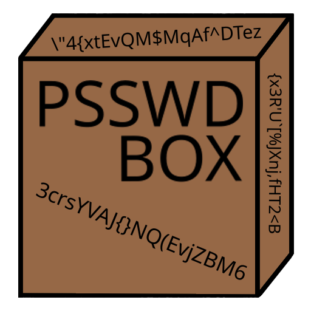

  

## Donations

- [Buy Me A Coffee](https://www.buymeacoffee.com/KingKairos)
- [GitHub Sponsors](https://github.com/sponsors/melvinquick)

## Purpose

The general purpose of this app is to give people an easy way to generate passwords completely locally on their machine. This doesn't rely on a cloud service, or any information leaving the local machine whatsoever.

## App Showcase

## Useful Information

- [Project Goals](https://codeberg.org/melvinquick/psswd_box/projects/12633)
